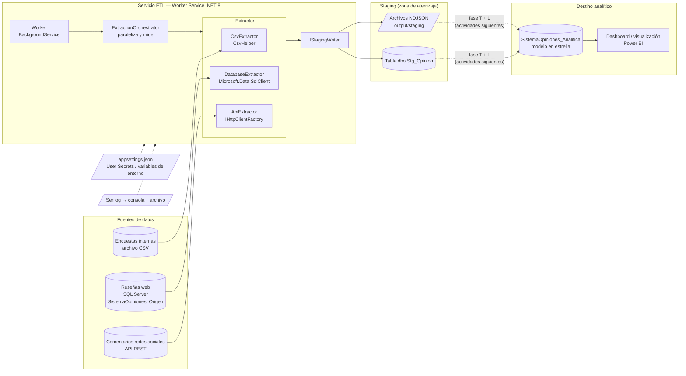
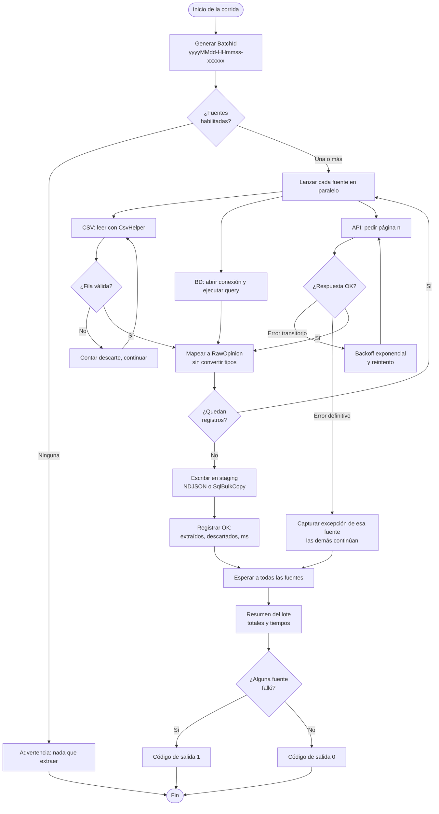

# Actividad 1 – Arquitectura y Proceso de Extracción

## Sistema de Análisis de Opiniones de Clientes

**Componente:** `SistemaOpiniones.Etl` — Worker Service en .NET 8
**Alcance:** fase de **extracción (E)** del proceso ETL

---

## 1. Diagrama de arquitectura



Las flechas punteadas hacia la base analítica marcan el límite de esta actividad: la
extracción termina en staging. La transformación y la carga son las fases siguientes.

### Componentes

| Componente | Tecnología | Responsabilidad |
|---|---|---|
| `Worker` | `BackgroundService` | Hospeda el proceso; corrida única o cíclica. |
| `ExtractionOrchestrator` | C# / `Task.WhenAll` | Identifica el lote, lanza las fuentes en paralelo, mide y reporta. |
| `CsvExtractor` | C#, CsvHelper | Lee y valida las encuestas internas. |
| `DatabaseExtractor` | C#, Microsoft.Data.SqlClient | Ejecuta la consulta de extracción sobre la BD de origen. |
| `ApiExtractor` | C#, `IHttpClientFactory` | Consume la API REST paginada, con reintentos. |
| `FileStagingWriter` / `SqlStagingWriter` | System.Text.Json / `SqlBulkCopy` | Aterrizan lo extraído en archivos o en tabla staging. |
| Serilog sobre `ILogger` | Serilog | Traza de eventos, errores y métricas. |

---

## 2. Diagrama de flujo del proceso



---

## 3. Justificación de las decisiones técnicas

### 3.1 Worker Service en lugar de aplicación de consola

La extracción es un proceso recurrente y desatendido. `BackgroundService` da el ciclo de
vida (arranque, apagado ordenado por `CancellationToken`), inyección de dependencias y
configuración por capas sin escribir nada de eso a mano. Además, con
`AddWindowsService()` el mismo binario se instala como servicio de Windows sin cambiar
código, y con `RunOnceAndExit: true` sirve para ejecución programada. Una sola base de
código cubre los dos modos de operación.

### 3.2 `IExtractor`: una abstracción por fuente

Las tres fuentes no se parecen en nada — un archivo, un `SqlDataReader` y una API
paginada — pero desde el punto de vista del proceso hacen lo mismo: producir registros.
Esa es exactamente la definición de la interfaz:

```csharp
public interface IExtractor
{
    string SourceName { get; }
    string SourceType { get; }
    bool Enabled { get; }
    IAsyncEnumerable<RawOpinion> ExtractAsync(ExtractionContext context, CancellationToken cancellationToken);
}
```

El orquestador recibe `IEnumerable<IExtractor>` y no conoce ninguna implementación
concreta. Es el **principio de inversión de dependencias** aplicado literalmente: la
política (orquestar, medir, reportar) no depende del detalle (cómo se lee un CSV).

También cumple **abierto/cerrado**: sumar una cuarta fuente —un archivo Excel, una cola
de mensajes— no modifica ninguna clase existente, solo agrega una y una línea de
registro en `Program.cs`.

### 3.3 `IAsyncEnumerable` en vez de devolver listas

Un extractor que devolviera `Task<List<RawOpinion>>` tendría que materializar la fuente
completa en memoria antes de escribir el primer registro. Devolviendo
`IAsyncEnumerable<RawOpinion>` los registros fluyen de la fuente al destino de a uno: el
consumo de memoria no depende del tamaño del archivo ni de cuántas filas devuelva la
consulta, y la escritura empieza mientras la lectura sigue en curso.

### 3.4 Staging crudo, sin tipos ni validación de negocio

`RawOpinion` guarda todos los campos como texto y la tabla `Stg_Opinion` los declara
`NVARCHAR`. Es deliberado: si la extracción intentara convertir tipos, un cambio de
formato de fecha en el origen haría **perder** el registro en lugar de registrarlo. Al
aterrizar crudo, el dato siempre queda persistido y la fase de transformación decide qué
hacer con él, con la evidencia original disponible.

Por la misma razón el `ApiExtractor` conserva el JSON completo en `RawPayload`: si el
mapeo resulta incompleto, el dato está en staging y no hay que volver a llamar la API.

### 3.5 `IStagingWriter` con dos implementaciones

El destino es una decisión de configuración, no de código. `FileStagingWriter` (NDJSON)
permite ejecutar y evidenciar la extracción sin depender de que haya un servidor
disponible; `SqlStagingWriter` es el destino de producción, con `SqlBulkCopy`. Los
extractores no saben cuál de los dos está activo.

Se eligió NDJSON —un objeto JSON por línea— y no un arreglo JSON único porque permite
escribir en streaming y volver a leer el archivo por partes.

### 3.6 Mapeo de la API dirigido por configuración

`ApiExtractor` no tiene una clase que refleje el contrato de la API. Lee el JSON con
`JsonDocument` y resuelve cada campo con el diccionario `FieldMap` de `appsettings.json`:

```json
"FieldMap": {
  "ExternalId": "id",
  "ClienteRef": "email",
  "ProductoRef": "postId",
  "Comentario": "body"
}
```

Un cambio en el contrato de la API, o el cambio de proveedor, se absorbe editando
configuración. Es la parte del sistema con mayor probabilidad de cambiar y la que menos
código requiere tocar.

### 3.7 `IHttpClientFactory` y no `new HttpClient()`

Instanciar `HttpClient` por llamada agota los sockets del sistema; reusarlo como
`static` deja de ver los cambios de DNS. `IHttpClientFactory` resuelve ambos: agrupa y
recicla los handlers en un intervalo configurado (`SetHandlerLifetime`).

### 3.8 Reintentos solo ante fallos transitorios

`ApiExtractor` reintenta con retroceso exponencial (1 s, 2 s, 4 s) ante 408, 429, 5xx y
timeouts. Un 401 o un 404 **no** se reintentan: no se arreglan esperando y reintentarlos
solo retrasa el diagnóstico.

---

## 4. Cumplimiento de los atributos de calidad

### 4.1 Rendimiento

| Mecanismo | Dónde | Efecto |
|---|---|---|
| Extracción en paralelo | `ExtractionOrchestrator.RunAsync` → `Task.WhenAll` | La corrida dura lo que la fuente más lenta, no la suma. |
| E/S asíncrona de punta a punta | `ExtractAsync`, `OpenAsync`, `ReadAsync`, `WriteLineAsync` | Ningún hilo queda bloqueado esperando disco, red o base de datos. |
| Streaming con `IAsyncEnumerable` | los tres extractores | Memoria constante, independiente del volumen. |
| `SqlBulkCopy` por lotes | `SqlStagingWriter` | Carga masiva por TDS en vez de un `INSERT` por fila. |
| Buffer de 64 KB y vaciado por lote | `FileStagingWriter` | Menos llamadas al sistema de archivos. |
| Medición con `Stopwatch` | por fuente y total | Métrica objetiva; se registra reg/s y el ahorro del paralelismo. |

Evidencia de una corrida real (ver `logs/etl-*.log`):

```
EncuestasInternas          CSV       OK    39 extraídos   1 descartados    138 ms
ResenasWeb                 Database  ERROR (SQL Server no disponible en el equipo de prueba)
ComentariosRedesSociales   ApiRest   OK   500 extraídos   0 descartados    900 ms
TOTAL: 539 registros, 1 descartados, 1 fuente con error en 15182 ms
       (suma secuencial 16176 ms; el paralelismo ahorró 994 ms)
```

`MaxDegreeOfParallelism` acota las fuentes simultáneas mediante `SemaphoreSlim`, para no
saturar la red o los servidores de origen cuando la cantidad de canales crezca.

### 4.2 Escalabilidad

- **Nuevas fuentes:** implementar `IExtractor` y registrarla. Ni el orquestador ni el
  Worker ni los escritores de staging cambian.
- **Encender y apagar canales:** `Sources.*.Enabled` en configuración, sin recompilar ni
  redesplegar.
- **Nuevo destino de staging:** implementar `IStagingWriter` (por ejemplo, hacia
  almacenamiento en la nube) sin tocar los extractores.
- **Volumen:** el streaming y la carga por lotes hacen que crecer en registros no cambie
  el perfil de memoria; solo el tiempo.
- **Extracción incremental:** la consulta de la fuente de base de datos está en
  configuración, así que filtrar por fecha de última carga es un cambio de texto.

### 4.3 Seguridad

- **Ninguna credencial en el repositorio.** `appsettings.json` contiene *nombres* de
  cadenas de conexión, nunca valores con credenciales. Los secretos llegan por **User
  Secrets** en desarrollo y por **variables de entorno** en despliegue, que el host
  incorpora a la cadena de configuración y tienen precedencia sobre el archivo.
- **Sin concatenación de SQL.** La consulta de extracción se define en configuración y se
  ejecuta tal cual; el proceso no arma SQL con datos de entrada, de modo que no hay
  superficie de inyección. La carga usa procedimientos almacenados con parámetros
  tipados.
- **Credencial de la API fuera del código y fuera del log.** Se inyecta como cabecera en
  el registro del `HttpClient` y nunca se escribe en la traza.
- **Conexiones cifradas.** Las cadenas de conexión usan `Encrypt=True`.
- **Datos de clientes fuera del control de versiones.** `.gitignore` excluye los archivos
  de origen reales y las salidas de staging; el repositorio solo lleva una muestra.
- **Errores sin filtración.** El resumen muestra el mensaje; la traza completa va al
  archivo de log, no a la salida estándar del resumen.

### 4.4 Mantenibilidad

- **Separación por capas y responsabilidad única:** `Worker` (ciclo de vida) →
  `ExtractionOrchestrator` (coordinación) → `IExtractor` (acceso a la fuente) →
  `IStagingWriter` (persistencia). Cada clase tiene un motivo para cambiar.
- **Configuración tipada:** `EtlOptions` enlaza la sección `Etl` completa y se inyecta
  con `IOptions<T>`; no hay lectura de configuración dispersa por el código.
- **Aislamiento de fallos:** cada fuente se extrae dentro de su propio `try/catch`. Si la
  API está caída, las encuestas y las reseñas se extraen igual y el resumen indica
  exactamente qué falló y por qué.
- **Trazabilidad:** cada registro lleva `BatchId`, `SourceName` y `ExtractedAtUtc`;
  siempre se puede reconstruir de dónde salió un dato y en qué corrida.
- **Logging por abstracción:** el código depende de `ILogger`; Serilog está detrás y sus
  destinos se declaran en `appsettings.json`. Cambiar de proveedor no toca el código.
- **Reutilización:** el `CsvExtractor` reutiliza `SurveyDto` de `SistemaOpiniones.Data`,
  que ya declara el mapeo de las cabeceras con tilde (`Clasificación`,
  `PuntajeSatisfacción`) mediante atributos de CsvHelper.

---

## 5. Evidencia del código

### 5.1 Orquestación paralela y medición

`SistemaOpiniones.Etl/Services/ExtractionOrchestrator.cs`

```csharp
var stopwatch = Stopwatch.StartNew();

using var gate = _options.MaxDegreeOfParallelism > 0
    ? new SemaphoreSlim(_options.MaxDegreeOfParallelism)
    : null;

var results = await Task.WhenAll(
    enabled.Select(extractor => ExtractSourceAsync(extractor, batchId, startedAtUtc, gate, cancellationToken)));

stopwatch.Stop();
LogSummary(batchId, results, stopwatch.ElapsedMilliseconds);
```

Aislamiento de fallos por fuente:

```csharp
catch (Exception ex)
{
    stopwatch.Stop();
    _logger.LogError(ex, "[{Source}] Falló la extracción tras {Elapsed} ms",
        extractor.SourceName, stopwatch.ElapsedMilliseconds);

    return ExtractionResult.Fail(
        extractor.SourceName, extractor.SourceType, ex.Message, stopwatch.ElapsedMilliseconds);
}
```

### 5.2 Extracción de CSV con validación tolerante

`SistemaOpiniones.Etl/Extractors/CsvExtractor.cs`

```csharp
ReadingExceptionOccurred = args =>
{
    var row = args.Exception.Context?.Parser?.Row;

    if (args.Exception is TypeConverterException)
    {
        context.RegisterRejected();
        _logger.LogWarning("Fila {Row} descartada en {Source}: {Message}", row, SourceName, args.Exception.Message);
    }
    else
    {
        _logger.LogWarning("Fila {Row} con formato irregular en {Source}: {Message}", row, SourceName, args.Exception.Message);
    }

    return false;   // no aborta la lectura del archivo
}
```

Se distingue el fallo de conversión —que sí descarta el registro— del cambio en el número
de columnas, que CsvHelper reporta pero igual entrega la fila. Sin esa distinción los
totales del reporte no cuadrarían con las filas del archivo.

### 5.3 Extracción de base de datos en streaming

`SistemaOpiniones.Etl/Extractors/DatabaseExtractor.cs`

```csharp
await using var connection = new SqlConnection(connectionString);
await connection.OpenAsync(cancellationToken);

await using var command = new SqlCommand(_options.Query, connection)
{
    CommandType = CommandType.Text,
    CommandTimeout = _options.CommandTimeoutSeconds
};

await using var reader = await command.ExecuteReaderAsync(cancellationToken);
var ordinals = MapOrdinals(reader);          // se resuelven una sola vez

while (await reader.ReadAsync(cancellationToken))
{
    yield return new RawOpinion { /* ... */ };
}
```

### 5.4 Consumo de API con reintentos

`SistemaOpiniones.Etl/Extractors/ApiExtractor.cs`

```csharp
if (!response.IsSuccessStatusCode)
{
    if (!IsTransient(response.StatusCode) || attempt > _options.RetryCount)
        throw new HttpRequestException($"La API respondió {(int)response.StatusCode} {response.ReasonPhrase} en '{url}'.");

    await DelayBeforeRetryAsync(attempt, $"HTTP {(int)response.StatusCode}", cancellationToken);
    continue;
}
```

### 5.5 Registro de fuentes y manejo de credenciales

`SistemaOpiniones.Etl/Program.cs`

```csharp
builder.Services.AddTransient<IExtractor, CsvExtractor>();
builder.Services.AddTransient<IExtractor, DatabaseExtractor>();
builder.Services.AddTransient<IExtractor, ApiExtractor>();

builder.Services.AddHttpClient(ApiExtractor.HttpClientName, (serviceProvider, client) =>
{
    var api = serviceProvider.GetRequiredService<IOptions<EtlOptions>>().Value.Sources.Api;

    client.BaseAddress = new Uri(api.BaseUrl, UriKind.Absolute);
    client.Timeout = TimeSpan.FromSeconds(api.TimeoutSeconds);

    // La llave nunca se registra en logs ni se guarda en appsettings.json.
    if (!string.IsNullOrWhiteSpace(api.ApiKey))
        client.DefaultRequestHeaders.Add(api.ApiKeyHeaderName, api.ApiKey);
})
.SetHandlerLifetime(TimeSpan.FromMinutes(5));
```

### 5.6 Registro extraído en staging

```json
{"BatchId":"20260806-032555-540cdb","SourceName":"EncuestasInternas","SourceType":"CSV",
 "ExternalId":"1","ClienteRef":"7","ProductoRef":"16","FuenteRef":"Encuesta",
 "Fecha":"2025-01-10","Comentario":"El proceso de compra fue muy sencillo, repetiría.",
 "Puntaje":"5","Clasificacion":"Positiva","ExtractedAtUtc":"2026-08-06T03:25:55.545Z","RawPayload":null}
```

---

## 6. Estado de la entrega

| Requisito de la actividad | Estado |
|---|---|
| Worker Service en .NET 8 | Implementado — `SistemaOpiniones.Etl` |
| Extracción CSV con CsvHelper | Implementado y ejecutado |
| Extracción desde BD relacional | Implementado; pendiente de servidor SQL para ejecutarlo |
| Extracción desde API REST con `HttpClient` | Implementado y ejecutado |
| Datos en archivos temporales o staging | Ambos: NDJSON y `dbo.Stg_Opinion` |
| Logs con `ILogger` | Implementado — `ILogger` + Serilog (consola y archivo) |
| Interfaz `IExtractor` y clases derivadas | Implementado |
| Métricas de rendimiento con `Stopwatch` | Implementado |
| Diagrama de arquitectura | Sección 1 |
| Diagrama de flujo del proceso | Sección 2 |
| Justificación de decisiones | Sección 3 |
| Atributos de calidad | Sección 4 |
| Evidencia de código | Sección 5 |

### Pendiente

La fuente de base de datos no se ha podido **ejecutar** porque el equipo de pruebas no
tiene SQL Server instalado. El código, el script de creación de la base de origen
(`Sql/02_Origen_ResenasWeb.sql`) y su configuración están completos: al levantar el
servidor y ajustar la cadena de conexión, la fuente entra sin cambios de código. La
corrida registrada muestra el comportamiento esperado ante ese escenario: las otras dos
fuentes se extraen con normalidad y el resumen señala exactamente qué falló.
